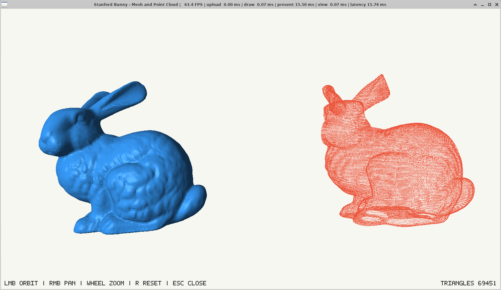

# TorchGL Viewer

A small high-performance 3D viewer for meshes and point clouds stored as
PyTorch CUDA tensors.

## Why

When working with CUDA tensors, a common visualization pipeline is:

```text
CUDA tensor -> CPU array -> viewer -> GPU
```

This is simple, but it becomes slow when the mesh is large or updated every
frame. The data is already on the GPU, but it is copied back to the CPU only to
be uploaded again to the GPU for rendering.

`TorchGLViewer` avoids this extra round trip.

```text
CUDA tensor -> OpenGL buffer -> screen
```

The viewer registers OpenGL buffers with CUDA and copies geometry directly from
CUDA memory into those buffers. This keeps visualization fast when the main
application already runs on the GPU.

## Why Not A Standard Viewer?

Standard 3D viewers are great for debugging and quick visualization, but many of
them update geometry from CPU memory. For small meshes this is fine. For many
dynamic triangles, it does not scale well.

This viewer is built for one specific case:

```text
the geometry is already a CUDA tensor and changes every frame
```

## Features

- CUDA tensor mesh rendering
- CUDA tensor point cloud rendering
- multiple named meshes
- mesh colors
- simple lighting
- orbit, pan, and zoom camera controls
- reset view with `R`
- close with `Esc`
- FPS counter
- render timing breakdown
- on-screen controls
- triangle counter

Controls:

```text
Left mouse  : orbit
Right mouse : pan
Wheel       : zoom
R           : reset view
Esc         : close
```

## Requirements

Python packages:

```bash
pip install glfw PyOpenGL cuda-python torch numpy
```

System requirements:

- Linux
- NVIDIA GPU
- NVIDIA driver with OpenGL support
- PyTorch with CUDA
- the OpenGL context and CUDA tensors must use the same physical GPU

On hybrid NVIDIA laptops or PRIME/Optimus systems, you may need:

```bash
export __NV_PRIME_RENDER_OFFLOAD=1
export __GLX_VENDOR_LIBRARY_NAME=nvidia
export __GL_SYNC_TO_VBLANK=0
```

Check that OpenGL is really using the NVIDIA GPU:

```bash
glxinfo -B
```

You should see something like:

```text
OpenGL vendor string: NVIDIA Corporation
OpenGL renderer string: NVIDIA GeForce ...
```

If you see `Mesa` or `llvmpipe`, the viewer is not using the NVIDIA OpenGL
driver and CUDA/OpenGL interop will not work.

## Demo

From the workspace root:

```bash
cd /home/nardi/sensor_fusion_ws/fitting_ws
```

Run the procedural demo. It does not need external meshes, models, or datasets.

```bash
__NV_PRIME_RENDER_OFFLOAD=1 __GLX_VENDOR_LIBRARY_NAME=nvidia __GL_SYNC_TO_VBLANK=0 \
python3 Vitruvius/viewer/demo_avatar_army.py --avatars 1024
```

Heavier version:

```bash
__NV_PRIME_RENDER_OFFLOAD=1 __GLX_VENDOR_LIBRARY_NAME=nvidia __GL_SYNC_TO_VBLANK=0 \
python3 Vitruvius/viewer/demo_avatar_army.py --avatars 4096 --spacing 0.85
```

Minimal triangle demo:

```bash
__NV_PRIME_RENDER_OFFLOAD=1 __GLX_VENDOR_LIBRARY_NAME=nvidia __GL_SYNC_TO_VBLANK=0 \
python3 Vitruvius/viewer/demo_torch_gl_viewer.py
```

Stanford bunny mesh and point cloud side by side:

```bash
__NV_PRIME_RENDER_OFFLOAD=1 __GLX_VENDOR_LIBRARY_NAME=nvidia __GL_SYNC_TO_VBLANK=0 \
python3 Vitruvius/viewer/demo_bunny_mesh_pointcloud.py
```

Preview:



## Reading The Timings

The window title shows:

```text
FPS | upload X ms | draw Y ms | present Z ms | view W ms | latency K ms
```

Meaning:

- `upload`: time spent copying CUDA geometry into OpenGL buffers
- `draw`: OpenGL rendering time
- `present`: time spent in `swap_buffers`
- `view`: `upload + draw`
- `latency`: total time from viewer update to presented frame

If `present` is around `16.6 ms`, the application is probably waiting for a
60 Hz display refresh. In that case, `view` is the important number for viewer
performance.

## Video

Add the demo video here:

```markdown

```

Or:

```html
<video src="path/to/demo.mp4" controls width="100%"></video>
```
